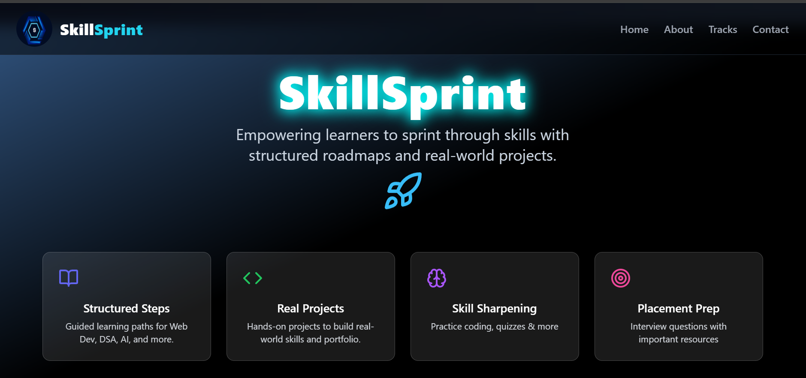
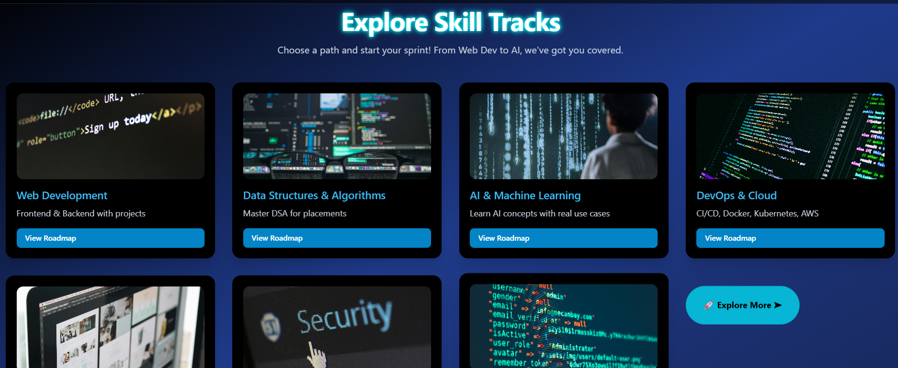
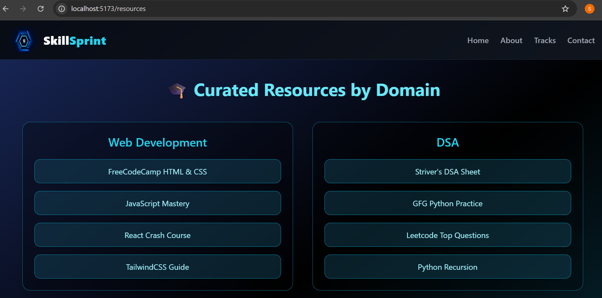

# 🚀 SkillSprint

> Your Ultimate Interactive Learning Platform for Tech Students

## 🌟 Overview

**SkillSprint** is a modern, responsive web application built using **React.js** and **Tailwind CSS**, designed to empower tech students with a structured and interactive way to upskill. With animated UI components and rich visuals, SkillSprint helps learners track their progress and stay motivated.

## ✨ Features

- 🎯 **Domain-Based Learning Tracks**  
  Structured roadmaps in various tech domains like Web Development, DSA, AI/ML, UI/UX, and more.

- 🧠 **Quiz Section**  
  Test your knowledge with domain-wise quizzes and MCQs.

- 💻 **Practice Section**  
  Solve curated coding questions and challenges to sharpen your skills.

- 📁 **Projects Hub**  
  Hands-on mini and major projects to build your portfolio.

- 🧑‍💼 **Interview Prep**  
  Get ready for placements with important DSA questions, behavioral tips, and company-wise guides.

- 💡 **Curated Resources**  
  Access handpicked tutorials, YouTube playlists, and free learning content.

- 📈 **Progress Tracking**  
  Track your learning journey with visual indicators and completion status.

- 🖼️ **Smooth UI with Animations**  
  Built with Tailwind CSS + Framer Motion to deliver a smooth and elegant UX.

## 🌐 Live Demo
🔗 [Visit SkillSprint Website](https://skillsprint-five.vercel.app/)

## 🛠 Tech Stack

| Frontend     | Styling        | Animations     | Deployment |
|--------------|----------------|----------------|------------|
| React.js     | Tailwind CSS   | Framer Motion  | Vercel     |

## 🧪 Upcoming Features

- 💬 Chat-based doubt-solving system  
- 🔔 Notification center  
- 🎥 Embedded video tutorials   
- 📊 Weekly goal tracking system

